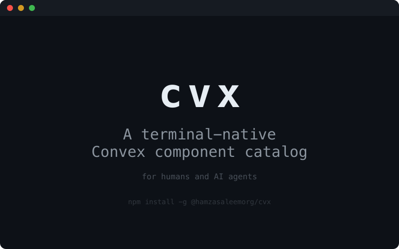

# cvx

[](https://www.npmjs.com/package/@hamzasaleemorg/cvx)



A terminal-native Convex component catalog — for humans and AI agents.

## Install

```bash
npm install -g @hamzasaleemorg/cvx
```

## CLI

```bash
cvx                    # fuzzy-find any component
cvx better-auth        # jump straight to a component
cvx list               # browse all components by category
cvx list -c Auth       # filter by category
```

Each component shows description, author, download count, and copy-paste
install instructions for `npm install` and `convex.config.ts`.

## MCP Server

Start an MCP server for AI agents (Claude, Cursor, Cline, etc.):

```bash
cvx mcp
```

Configure your AI tool:

```json
{
  "mcpServers": {
    "cvx": {
      "command": "cvx",
      "args": ["mcp"]
    }
  }
}
```

Agents get access to three tools: `search_components`, `get_component`, `get_install` — all backed by live component data.
